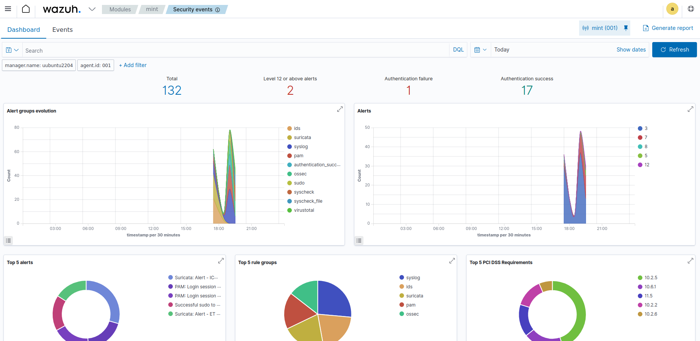
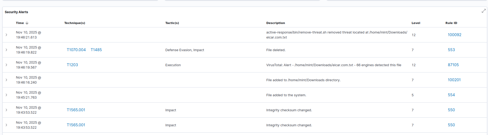
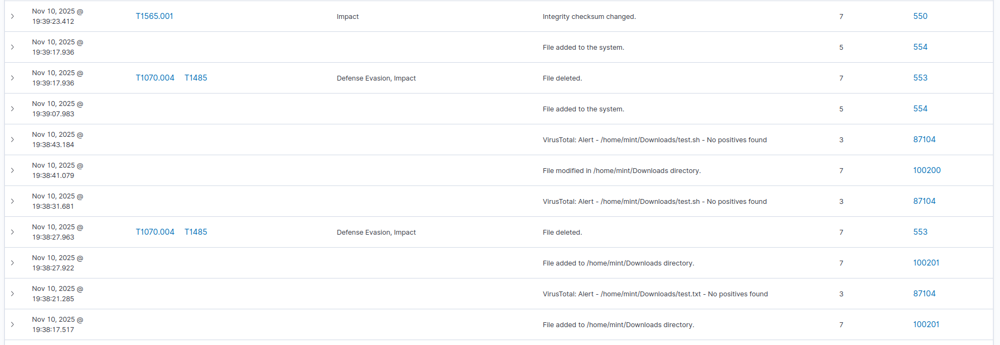

<h1 align="center">Proof of Concept</h1>

## Wazuh - VirusTotal Integration for Automated File Deletion

This Proof of Concept demonstrates the integration of Wazuh with VirusTotal to automatically detect and delete malicious files on monitored endpoints using Wazuh's Active Response capabilities.

### Changes Implemented:

1.  **Wazuh Manager Configuration (`ossec.conf`)**:
    *   Integrated VirusTotal API key to enable scanning of file hashes.
    *   Defined a custom `remove-threat` command for active response.
    *   Configured an active response rule to trigger the `remove-threat` command when VirusTotal identifies a file as malicious (using rule ID `87105`).
    *   Corrected the `ossec.conf` structure by merging multiple `<ossec_config>` blocks into a single, valid one.

2.  **Wazuh Agent Configuration (`ossec.conf`)**:
    *   Enabled File Integrity Monitoring (FIM) for critical directories (`/tmp` and user's `Downloads` folder) to detect new file creations in real-time.

3.  **Active Response Script (`remove-threat.sh`)**:
    *   A custom Bash script (`remove-threat.sh`) was created and deployed on the agent. This script is responsible for parsing the alert data and securely deleting the identified malicious file.

### Proof of Concept Result:

When an EICAR test file (or any file identified as malicious by VirusTotal) is introduced into a monitored directory on the agent, Wazuh detects it, sends its hash to VirusTotal, and upon confirmation of maliciousness, automatically executes the `remove-threat.sh` script to delete the file.

  
   
  <em>Image 1: Wazuh dashboard showing initial detection of malicious file.</em>

  
   
  <em>Image 2: Wazuh dashboard showing VirusTotal analysis result.</em>

  
   
  <em>Image 3: Wazuh dashboard showing active response action (file removal).</em>

### Reference Files:

*   `manager.conf` (Wazuh Manager's `ossec.conf` with VirusTotal integration and Active Response configuration)
*   `agent.conf` (Wazuh Agent's `ossec.conf` with FIM configuration)
*   `rules.xml` (Custom rules for active response logging, if created)
*   `remove-threat.sh` (Active Response script on the agent)

For further information on Wazuh Proof of Concepts, visit:
[Wazuh Proof of Concept Guide](https://documentation.wazuh.com/current/proof-of-concept-guide/index.html)
